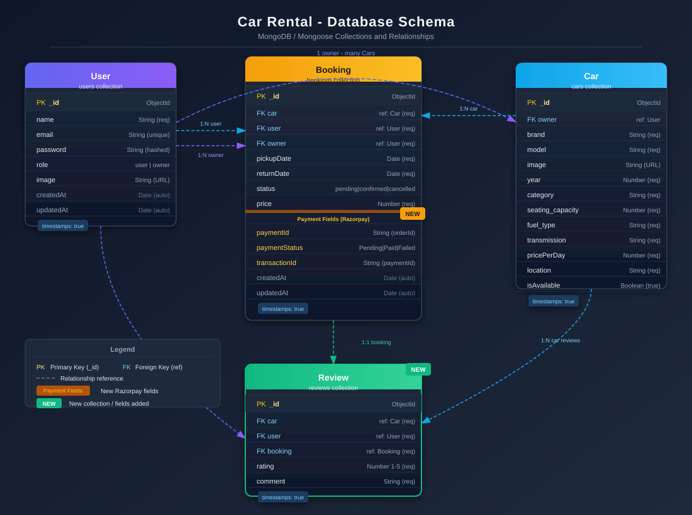

# 🚗 Car Rental Website

A modern, full-stack car rental platform built with the MERN stack, offering seamless vehicle booking and management services with an intuitive user interface, robust backend architecture, integrated Razorpay payment gateway, and a verified review system.

## 🌐 Live Demo

**[View Live Application](https://car-rental-website1-omega.vercel.app/)**

## 📝 Project Diagrams

### Application Flowchart


---

### Database Schema



## 📋 Table of Contents

- [Overview](#overview)
- [Features](#features)
- [Tech Stack](#tech-stack)
- [Architecture](#architecture)
- [Installation](#installation)
- [Usage](#usage)
- [API Documentation](#api-documentation)
- [Performance](#performance)
- [Security Features](#security-features)
- [Contributing](#contributing)
- [License](#license)

## 🎯 Overview

This car rental website is a comprehensive solution designed to streamline the vehicle rental process for both customers and administrators. Built with modern web technologies, it provides a seamless booking experience with real-time availability, secure payment processing via Razorpay, a verified post-rental review system, and efficient fleet management.

The application addresses the growing demand for digital car rental services by offering:
- Intuitive user interface for easy vehicle browsing and booking
- Comprehensive admin panel for fleet and booking management
- Responsive design ensuring optimal experience across all devices
- Secure authentication and data protection
- Integrated Razorpay payment gateway for seamless transactions
- Verified review system — only users who have completed a rental can leave a review

## ✨ Features

### 🔐 User Authentication & Authorization
- Secure user registration and login system
- JWT-based authentication
- Role-based access control (Admin/Owner/Customer)
- Password encryption with bcrypt and secure session management

### 🚙 Vehicle Management
- Comprehensive car catalog with detailed specifications
- Advanced search and filtering capabilities (location, dates, category)
- Real-time availability tracking
- Dynamic pricing based on duration and vehicle type
- High-quality image gallery with ImageKit integration
- Star ratings and review summaries displayed per car

### 📅 Booking System
- Interactive date picker for rental duration
- Real-time availability checking
- Booking confirmation and management
- Auto-cancellation of expired unpaid bookings
- Booking history with status tracking (`pending`, `confirmed`, `cancelled`)
- `canReview` and `hasReviewed` flags per booking for review eligibility

### 💳 Payment Gateway (Razorpay) *(New)*
- Razorpay order creation per booking
- Secure client-side Razorpay checkout modal (Card, UPI, NetBanking)
- HMAC-SHA256 server-side signature verification
- Booking updated with `paymentStatus: Paid`, `transactionId`, and `paymentId` on success
- Payment failure and invalid signature handling

### ⭐ Review System *(New)*
- Post-rental review submission (only after confirmed booking whose return date has passed)
- One review per booking enforced server-side
- Star rating (1–5) with comment
- Reviews displayed on Car Detail page
- Average rating and review count summary per car (via aggregation)
- Latest reviews displayed on homepage

### 📱 Responsive Design
- Mobile-first design approach
- Cross-browser compatibility
- Optimized performance on all device sizes

### 🛡️ Admin / Owner Dashboard
- Fleet management and vehicle CRUD operations
- Booking overview and management (confirm / cancel bookings)
- User management and analytics
- Revenue tracking and reporting
- Profile image management via ImageKit

## 🛠️ Tech Stack

### Frontend
- **React.js** — Component-based UI library
- **Context API** — State management solution
- **Tailwind CSS** — Utility-first CSS framework
- **React Router** — Client-side routing
- **Axios** — HTTP client for API calls
- **React Hook Form** — Form validation and handling
- **Razorpay JS SDK** — Client-side payment modal

### Backend
- **Node.js** — JavaScript runtime environment
- **Express.js** — Web application framework
- **MongoDB** — NoSQL database
- **Mongoose** — MongoDB object modeling
- **Razorpay Node SDK** — Server-side payment order creation & verification
- **crypto (Node built-in)** — HMAC-SHA256 signature verification

### Additional Services
- **ImageKit** — Image optimization and management
- **JWT** — JSON Web Token for authentication
- **Bcrypt** — Password hashing
- **Vercel** — Deployment and hosting platform

## 🏗️ Architecture

```
car-rental-website/
├── client/                   # React frontend (Vite)
│   ├── src/
│   │   ├── components/       # Reusable UI components
│   │   ├── pages/            # Page components
│   │   │   ├── Home.jsx
│   │   │   ├── Cars.jsx
│   │   │   ├── CarDetails.jsx
│   │   │   ├── MyBookings.jsx
│   │   │   ├── Profile.jsx
│   │   │   └── owner/        # Owner dashboard pages
│   │   ├── context/          # Context API providers
│   │   └── assets/           # Static assets
│   ├── public/
│   └── package.json
├── server/                   # Node.js backend
│   ├── controllers/
│   │   ├── userController.js
│   │   ├── ownerController.js
│   │   ├── bookingController.js
│   │   ├── paymentController.js  # Razorpay integration
│   │   └── reviewController.js   # Review CRUD
│   ├── models/
│   │   ├── User.js
│   │   ├── Car.js
│   │   ├── Booking.js            # Includes paymentId, paymentStatus, transactionId
│   │   └── Review.js             # New review model
│   ├── routes/
│   │   ├── userRoutes.js
│   │   ├── ownerRoutes.js
│   │   ├── bookingRoutes.js
│   │   ├── paymentRoutes.js      # Razorpay routes
│   │   └── reviewRoutes.js       # Review routes
│   ├── middlewares/              # Auth middleware
│   ├── config/                   # DB config
│   ├── server.js
│   └── package.json
├── Flowchart.svg                 # Application flow diagram
├── Database_Diagram.svg          # Database schema diagram
└── README.md
```

## 🚀 Installation

### Prerequisites
- Node.js (v16 or higher)
- MongoDB (local or Atlas cloud instance)
- npm or yarn package manager
- Razorpay account (for payment integration)

### Clone Repository
```bash
git clone https://github.com/Aniketghosh2003/Car-Rental-website.git
cd Car-Rental-website
```

### Backend Setup
```bash
cd server
npm install

# Create environment file and configure variables
cp .env.example .env

npm run dev
```

### Frontend Setup
```bash
cd client
npm install
npm run dev
```

### Environment Variables

#### Server (.env)
```env
NODE_ENV=development
PORT=5000
MONGOURI_URI=your_mongodb_connection_string
JWT_SECRET=your_jwt_secret_key
IMAGEKIT_PUBLIC_KEY=your_imagekit_public_key
IMAGEKIT_PRIVATE_KEY=your_imagekit_private_key
IMAGEKIT_URL_ENDPOINT=your_imagekit_url_endpoint
RAZORPAY_KEY_ID=your_razorpay_key_id
RAZORPAY_KEY_SECRET=your_razorpay_key_secret
```

#### Client (.env)
```env
VITE_API_URL=http://localhost:5000/api
VITE_RAZORPAY_KEY_ID=your_razorpay_key_id
```

## 📖 Usage

### For Customers
1. **Browse Vehicles**: Explore available cars with detailed information and star ratings
2. **Search & Filter**: Use advanced filters (location, dates, category) to find the perfect vehicle
3. **Book Rental**: Select dates, review pricing, and confirm booking
4. **Pay Online**: Complete payment via Razorpay (Card / UPI / NetBanking)
5. **Manage Bookings**: View booking history, payment status, and current reservations
6. **Leave a Review**: After your rental ends, submit a star rating and comment on the car

### For Administrators / Owners
1. **Fleet Management**: Add, update, or remove vehicles from inventory
2. **Booking Oversight**: Monitor all bookings, confirm or cancel them
3. **User Management**: Manage customer accounts and permissions
4. **Analytics Dashboard**: View business metrics and performance data (`GET /api/owner/dashboard`)
5. **Profile Management**: Update owner profile image via ImageKit

## 📊 API Documentation

### User Endpoints
```
POST /api/user/register         # User registration
POST /api/user/login            # User login
GET  /api/user/data             # Get user data (protected)
GET  /api/user/cars             # Get all available cars
```

### Owner Endpoints
```
POST   /api/owner/change-role      # Change role: user → owner (protected)
POST   /api/owner/add-car          # List / add a car for rent (protected)
GET    /api/owner/cars             # Get all cars listed by owner (protected)
POST   /api/owner/toogle-cars      # Toggle car availability (protected)
POST   /api/owner/delete-cars      # Delete a car listing (protected)
GET    /api/owner/dashboard        # Get owner dashboard analytics (protected)
POST   /api/owner/update-image     # Update owner profile image (protected)
```

### Booking Endpoints
```
POST    /api/bookings/check-availability    # Check available cars by location + dates
POST    /api/bookings/create                # Create new booking (protected)
GET     /api/bookings/user                  # Get user's bookings with canReview/hasReviewed flags (protected)
GET     /api/bookings/owner                 # Get all bookings for owner's cars (protected)
POST    /api/bookings/change-status         # Update booking status: confirm | cancel (protected)
```

### Payment Endpoints *(New)*
```
POST    /api/payment/create-order       # Create Razorpay order for a booking (protected)
POST    /api/payment/verify-payment     # Verify Razorpay signature, mark booking as Paid (protected)
```

### Review Endpoints *(New)*
```
GET     /api/reviews                    # Get latest reviews (public, for homepage)
GET     /api/reviews/summary            # Get average rating + count per car (public)
GET     /api/reviews/car/:carId         # Get all reviews for a specific car (public)
POST    /api/reviews                    # Submit a review after completed rental (protected)
```

## 📈 Performance

- **Page Load Speed**: < 3 seconds initial load
- **Image Optimization**: ImageKit integration for optimized image delivery
- **Code Splitting**: Lazy loading for optimal bundle size
- **Caching Strategy**: Efficient API response caching
- **Database Optimization**: Indexed queries for fast data retrieval

## 🔒 Security Features

- JWT-based authentication with secure token handling
- Password hashing using bcrypt
- Razorpay HMAC-SHA256 signature verification for payment integrity
- Input validation and sanitization
- CORS configuration for cross-origin security
- Review eligibility enforced server-side (confirmed booking + return date passed + one per booking)
- Rate limiting to prevent API abuse
- Secure HTTP headers implementation

## 🌟 Key Highlights

- **Razorpay Payment Integration**: End-to-end secure payment flow with signature verification
- **Verified Reviews**: Reviews tied to completed bookings — no fake reviews possible
- **Auto-Cancel Logic**: Expired unpaid bookings are automatically cancelled
- **Scalable Architecture**: Modular design supporting future enhancements
- **User-Centric Design**: Intuitive interface with excellent user experience
- **Performance Optimized**: Fast loading times and smooth interactions
- **Mobile Responsive**: Seamless experience across all devices
- **Production Ready**: Deployed on Vercel with CI/CD pipeline

## 🚀 Deployment

The application is deployed on Vercel with automatic deployments from the main branch:

**Frontend**: Deployed on Vercel with optimized Vite build settings
**Backend**: RESTful API hosted on Vercel serverless functions
**Database**: MongoDB Atlas for reliable data storage
**CDN**: ImageKit for global image delivery
**Payments**: Razorpay payment gateway (test/live mode)

## 🤝 Contributing

Contributions are welcome! Please feel free to submit a Pull Request. For major changes, please open an issue first to discuss what you would like to change.

1. Fork the Project
2. Create your Feature Branch (`git checkout -b feature/AmazingFeature`)
3. Commit your Changes (`git commit -m 'Add some AmazingFeature'`)
4. Push to the Branch (`git push origin feature/AmazingFeature`)
5. Open a Pull Request

## 📄 License

This project is licensed under the MIT License — see the [LICENSE](LICENSE) file for details.


⭐ **If you found this project helpful, please consider giving it a star!**
⭐ **Special thanks to the GreatStack YouTube Channel**
